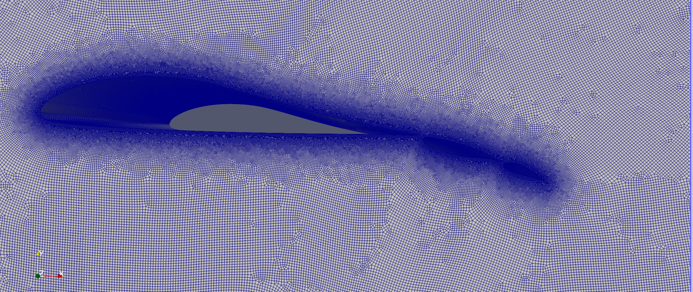
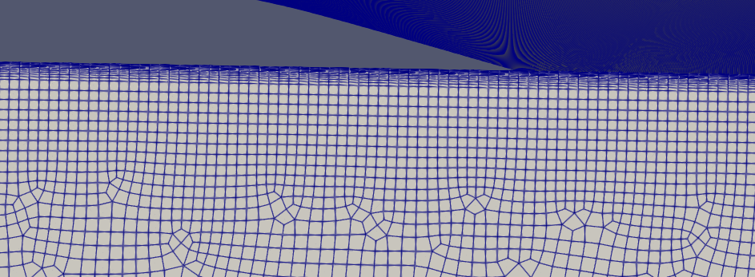
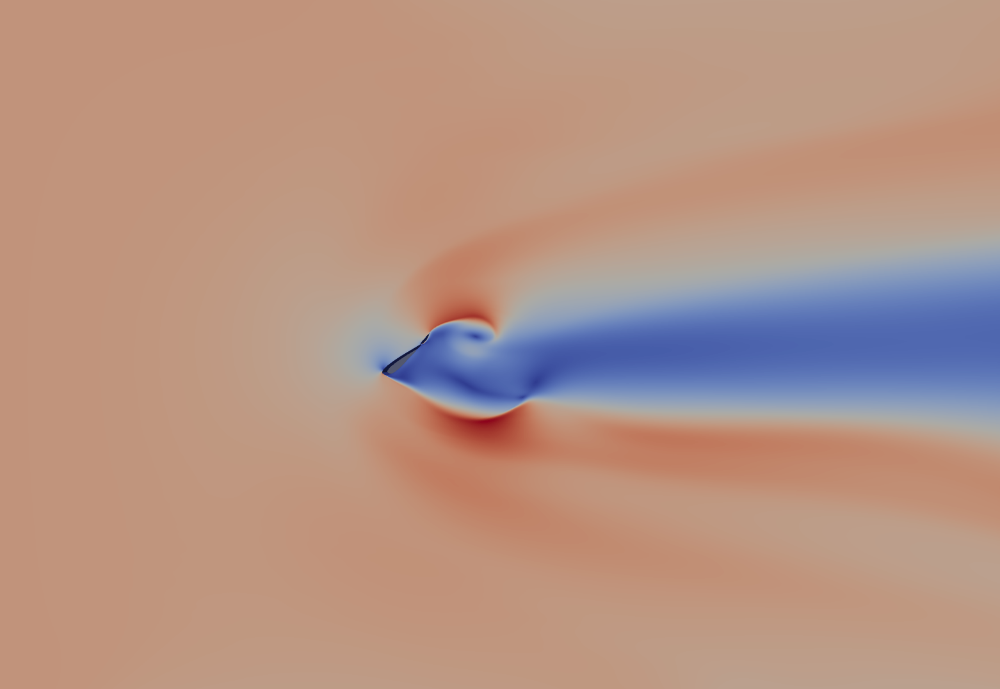
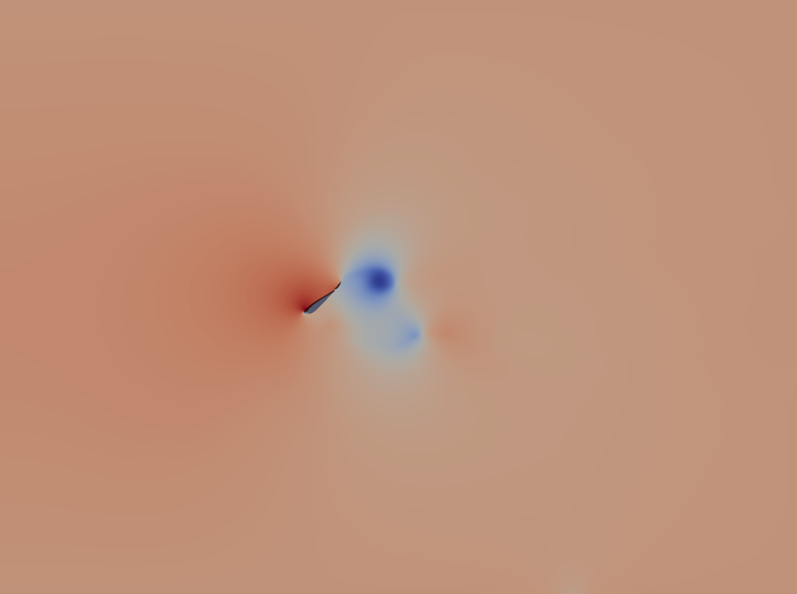

# Multi-Airfoil CFD Dataset Generation & Neural Operator Surrogate

**Status:** 🔄 Data Generation Pipeline (Complete) | ⚙️ Preprocessing (Complete) | 🧠 ML Model Architecture (In Progress)

---

## 📖 Abstract

This work presents a comprehensive pipeline for the generation of high-fidelity CFD datasets and the development of neural surrogate models for aerodynamic applications. A fully automated framework is implemented to produce 2D turbulent flow simulations over multi-airfoil configurations, with the resulting dataset serving as the foundation for training a Physics-Informed Neural Operator. The pipeline is designed for scalable execution on high-performance computing clusters and aims to establish a digital twin capable of rapid aerodynamic prediction.

---

## 🔬 Project Pipeline

The workflow is fully automated, spanning from geometric generation to HPC execution and data storage.

### 1️⃣ Parameter Space Exploration
Generates random airfoil configurations and flow conditions using a **Sobol sequence** to ensure a quasi-random, low-discrepancy spread across the design space. The parameters include:

    Reynolds number: Re in [10^4, 10^6] (incompressible, transitional regime)
    
    Angle of attack: alpha in [0 deg, 45 deg]
    
    Airfoil geometry parameters (NACA profiles, multi-element positions)

### 2️⃣ Automated Meshing

Constructs a 2D unstructured mesh around the multi-airfoil setup using Gmsh with a Python interface. The algorithm enforces a y+≈1 boundary layer to accurately resolve the near-wall physics for transitional flows.

<table align="center">
    <tr>
        <td align="center" width="50%">
            
             
            <em>(a) Airfoil mesh</em>
        </td>
        <td align="center" width="50%">
            
             
            <em>(b) Boundary layer with $y^+ \approx 1$</em>
        </td>
    </tr>
</table>

<strong>Figure 1:</strong> Mesh resolution and boundary layer refinement.

Key meshing features:

    Adaptive refinement near airfoil surfaces

    Wake refinement zone for accurate downstream predictions

    Boundary layer calculation: Δy=y+μρuτ

### 3️⃣ HPC Simulation

Launches simpleFoam (OpenFOAM) with the transitional k-ω SST model across 1000+ cases on the university SLURM cluster.

    Solver: simpleFoam (steady-state incompressible)

    Turbulence model: k-ω SST with γ-Reθ​ transition model

    Convergence criteria: Residuals < 10−6

### 4️⃣ Post-processing & Data Storage

Extracts pressure and velocity fields from OpenFOAM results and compresses them into HDF5 files for efficient data loading.

Extracted fields:

    Pressure field: p(x,y)

    Velocity field: u(x,y)=(u,v)

    Surface Coefficients: Pressure Coeff (Cp), Friction Coeff (Cf)

    Lift and drag coefficients: CL​, CD
    
    Turbulence fields: gamma, nut, k, ReThetat, omega​

<table align="center" style="border-collapse: collapse; width: 100%; max-width: 900px;">
    <tr>
        <td align="center" style="padding: 10px; width: 50%;">
            
             
            <em><strong>Figure 2a:</strong> Velocity field distribution</em>
        </td>
        <td align="center" style="padding: 10px; width: 50%;">
            
             
            <em><strong>Figure 2b:</strong> Pressure field distribution</em>
        </td>
    </tr>
    <tr>
        <td colspan="2" align="center" style="padding-top: 5px;">
            <em><strong>Figure 2:</strong> Flow field results around multi-airfoil configuration with high turbulence.</em>
        </td>
    </tr>
</table>

### 5️⃣ Preprocessing into PyTorch Tensors

    Custom Dataset and Dataloader objects

    Global normalizer to normalize only with training data and apply normalization to test and validation with no leakage

    Auto generation of set splits into individual Dataloaders

    Direct reading from .h5 to optimize VRAM usage

## 🎯 Key Technical Highlights

| **Skill Domain** | **Implementation Details** |
|:-----------------|:---------------------------|
| **Advanced Geometry** | Multi-element airfoil mesh generation handling overlapping boundaries and wake refinement using Gmsh API |
| **CFD & Turbulence** | Transitional k-omega SST model implementation with $y^+$ resolution; convergence stabilization across diverse flow regimes |
| **High-Performance Computing** | SLURM-aware pipeline with array jobs; I/O optimization for 1000+ cases; parallel post-processing |
| **Data Engineering** | HDF5 compression; PyTorch DataLoader with custom collation for unstructured mesh data; physics-aware normalization |
| **Scientific Python** | NumPy, SciPy (Sobol QMC), Matplotlib, PyVista for visualization |

### TO BE ADDED

    Mollified GINO with boundary awareness and distance

    Custom loss function with distance based scaling and inverse area weighting for increased penalty within boundary region

    Incorporate physics terms with adaptive weighting to compare effectiveness across range of n training samples
